# Smart Extension to Selectively Redact Web Pages Using Deep Learning

[](https://opensource.org/licenses/MIT)
[](https://www.python.org/downloads/)
[](https://developer.mozilla.org/en-US/docs/Web/JavaScript)
[](https://tensorflow.org/)

A cross-browser extension that uses deep learning to detect and redact NSFW (Not Safe For Work) content in real-time, providing a safer browsing experience for users in professional, educational, or family environments.

## 📋 Abstract

The sudden growth and scale of the internet make it impossible to have a central authority to control the content being shared. Internet companies like Meta have community guidelines for policing the content uploaded to their site. However, this is restricted to their respective platforms, and the internet is much broader. While other forms of media like television have a clearly defined system for censorship, there is a vacuum in the tech world in protecting users from being exposed to sensitive content. 

The work proposes to build a deep learning model that classifies the contents of a webpage as Safe or Not safe for work (NSFW) using techniques such as image classification and sentiment analysis. NSFW content is anything deemed inappropriate in a public setting, including age-restricted content. The end product would be a cross-browser web extension that can detect and classify content as safe or NSFW in real time and redact the said content from being displayed in the client's browser. A web extension would be a universal and easy-to-use solution for the user to protect themselves from sensitive content on the internet.

## 🎯 Problem Statement

With an estimated 64 Zettabytes of data on the internet, it's impossible to have centralized content control. Key challenges include:

- **Unfiltered Content**: Most websites lack content filtering mechanisms
- **Child Safety**: Children can easily access inappropriate content despite safety mechanisms
- **Professional Environments**: NSFW content can appear unexpectedly in workplace settings
- **Content Creator Risks**: Streamers face platform bans due to accidental exposure to inappropriate content
- **Exponential Growth**: NSFW content has been growing exponentially since the inception of the web

## ✨ Features

### 🔍 Real-Time Content Detection
- **Text Classification**: Multi-label classification for toxic, obscene, insulting, threatening, and hate speech content
- **Image Classification**: NSFW image detection using convolutional neural networks
- **Live Processing**: Real-time analysis of web page content as you browse

### 🛡️ Smart Filtering
- **Selective Redaction**: Blurs or removes inappropriate content while preserving safe material
- **Multi-Category Detection**: Identifies various types of inappropriate content including:
  - **Toxic**: Nasty, disrespectful comments likely to cause users to quit conversations
  - **Obscene**: Content violating accepted moral norms, depicting sex offensively
  - **Insult**: Crude or offensive statements intended to hurt or offend
  - **Identity Hate**: Attacks based on religion, ethnicity, nationality, race, gender, etc.
  - **Severe Toxic**: More severe toxic content that attacks personal identity
  - **Threat**: Declarations of harm or unfavorable consequences

### 🌐 Universal Compatibility
- **Cross-Browser Support**: Works on Chrome, Firefox, Edge, and other Chromium-based browsers
- **Ad Blocking**: Built-in ad blocker for enhanced user experience
- **Privacy-First**: Client-side scraping with cloud-based processing for optimal privacy

## 🏗️ System Architecture

The system follows a three-tier architecture:

1. **Data Tier**: Web scraping and data preprocessing
2. **Model Tier**: Deep learning models for text and image classification  
3. **Application Tier**: Browser extension and cloud backend

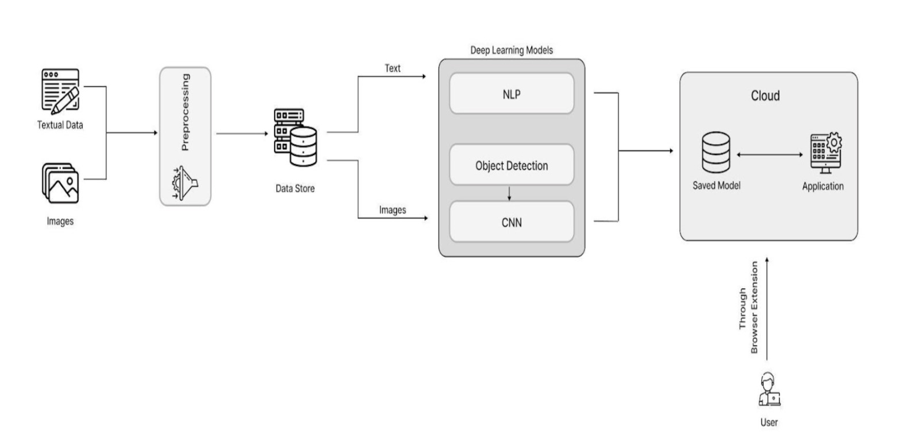


*Figure 3.1: System Architecture for the Smart Browser Extension*

### Data Flow Overview

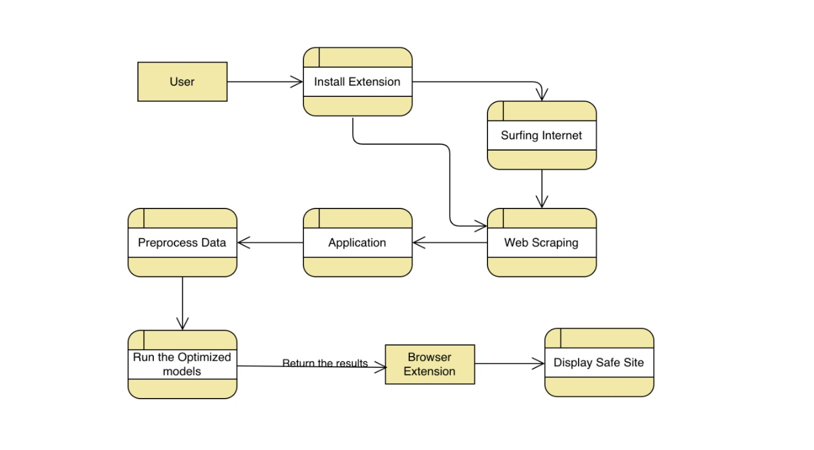
*Figure 3.2: Level 0 Data Flow Diagram*

The user downloads and installs the browser extension from their preferred browser's store. The extension scrapes the website being accessed and sends it to the backend application, which performs preprocessing and runs the optimized model to classify whether the data is sensitive or not. The application passes this data back to the browser extension which renders the page with only the safe content.

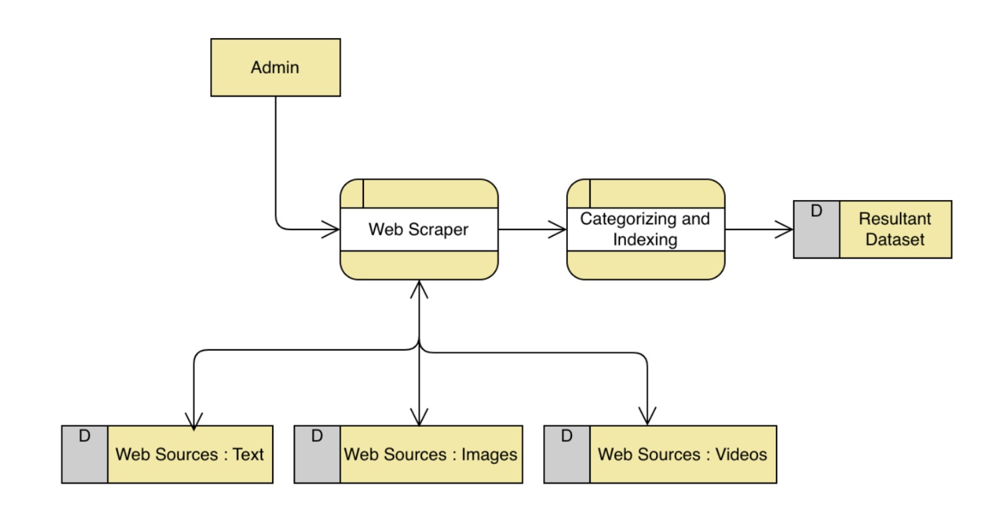
*Figure 3.3: Data Flow Diagram for Data Collection*

## 📊 Dataset Description

### Text Dataset
- **Source**: Jigsaw Conversation on Kaggle
- **Size**: 38,000 comments from Wikipedia
- **Categories**: 6 toxic behavior types (toxic, obscene, insult, severe_toxic, identity_hate, threat)
- **Additional**: 1,000+ swear words corpus built from scratch

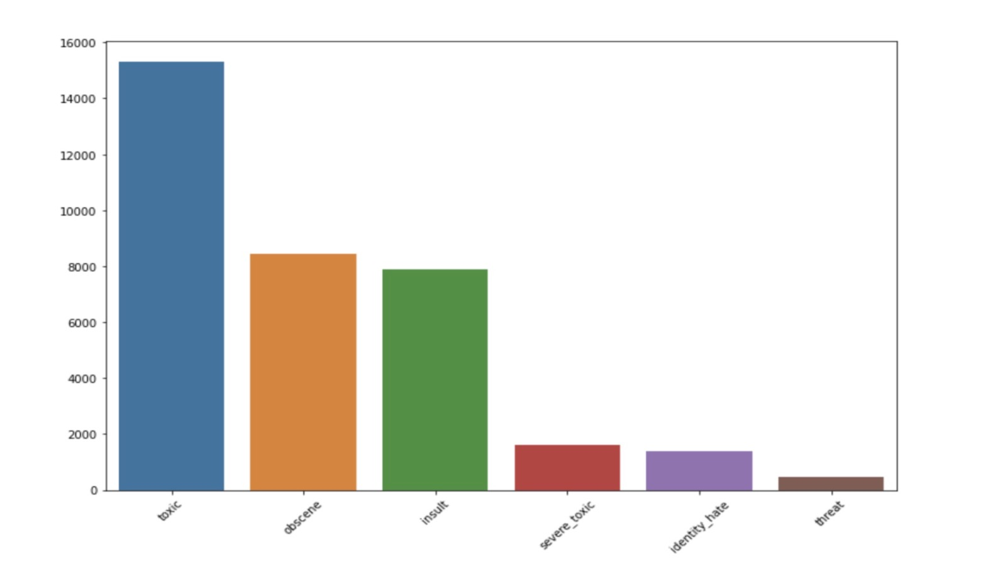
*Figure 4.1: Comparison of various labels in the dataset*

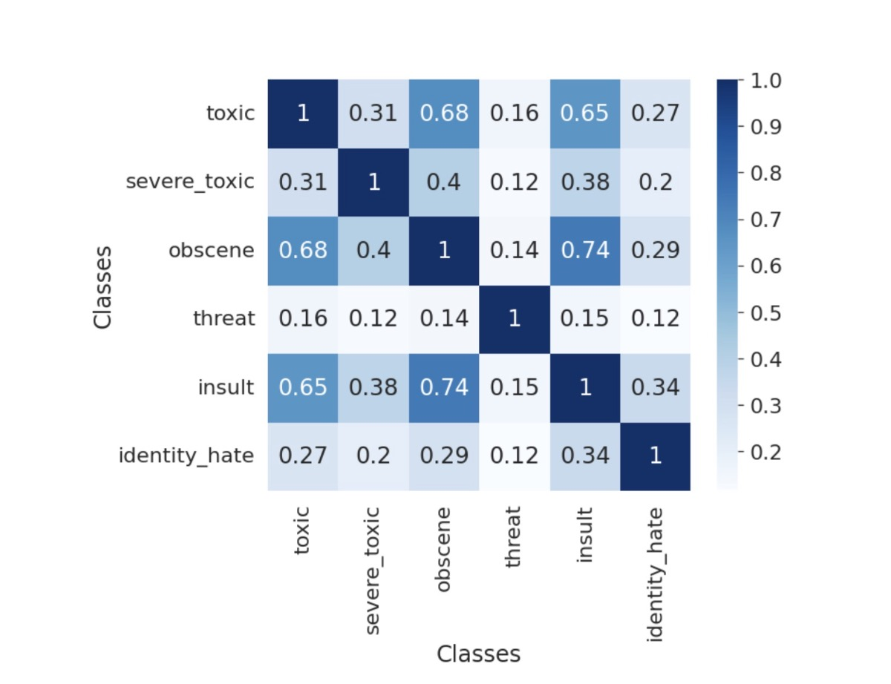
*Figure 4.2: Correlation heat mapping between different content categories*

### Image Dataset
- **Source**: Alex Kim's GitHub repository
- **Size**: ~500 GB of web-hosted images
- **Categories**: 5 types (porn, hentai, sexy, neutral, drawings)
- **Storage**: Organized by label directories via shell script

## 🚀 Installation

### Prerequisites
- Python 3.7+
- Node.js 14+
- Modern web browser (Chrome/Firefox/Edge)

### Backend Setup

1. **Clone the repository**
```bash
git clone https://github.com/vaarunx/realtime-censorship.git
```

2. **Install Python dependencies**
```bash
cd ImageServer
pip install -r requirements.txt
```

3. **Install Node.js dependencies**
```bash
cd ../`Express Server`
npm install
```

4. **Start the Express server (Text Classification)**
```bash
npm start
```

5. **Start the Flask server (Image Classification)**
```bash
cd ImageServer
python app.py
```

### Browser Extension Setup

1. **Load the extension in Chrome:**
   - Open Chrome and navigate to `chrome://extensions/`
   - Enable "Developer mode"
   - Click "Load unpacked" and select the `extension` folder

2. **Load the extension in Firefox:**
   - Open Firefox and navigate to `about:debugging`
   - Click "This Firefox" → "Load Temporary Add-on"
   - Select the `manifest.json` file from the `extension` folder

## 🔧 Usage

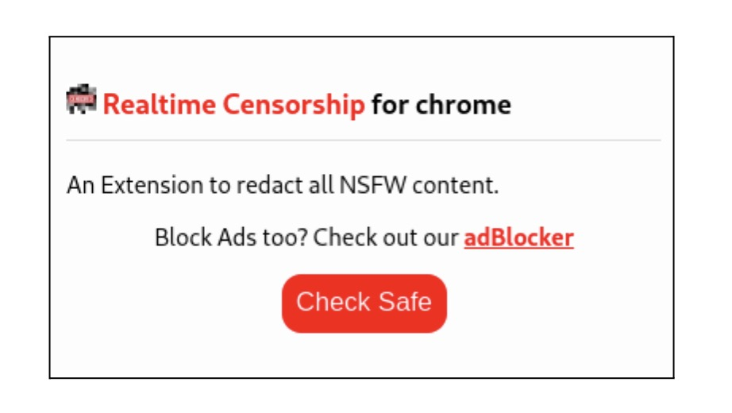
*Figure 5.2: Browser Extension Usage Interface*

1. **Install the Extension**: Follow the installation steps above
2. **Browse Normally**: The extension runs in the background
3. **Activate Filtering**: Click the extension icon and select "Check Safe"
4. **View Results**: NSFW content will be automatically blurred or removed

### Ad Blocking Feature

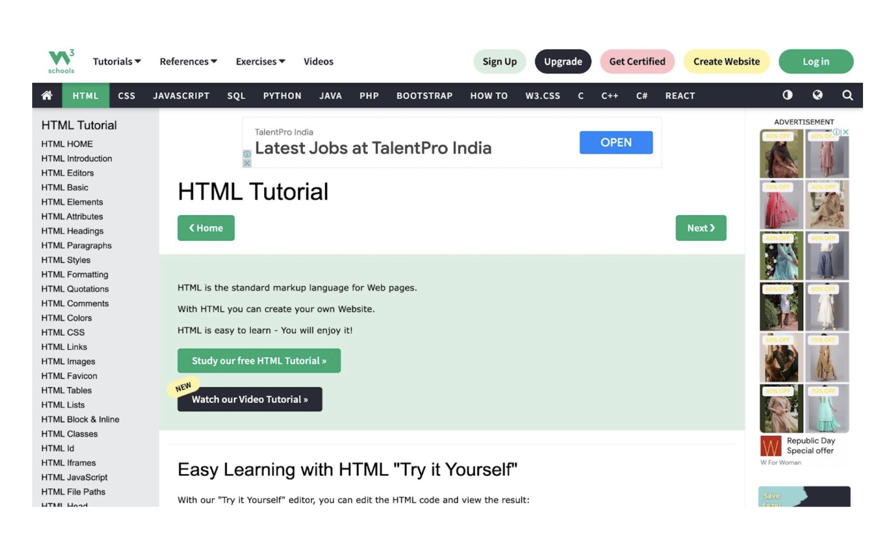
*Figure 5.3: Website before enabling the Ad Blocker*

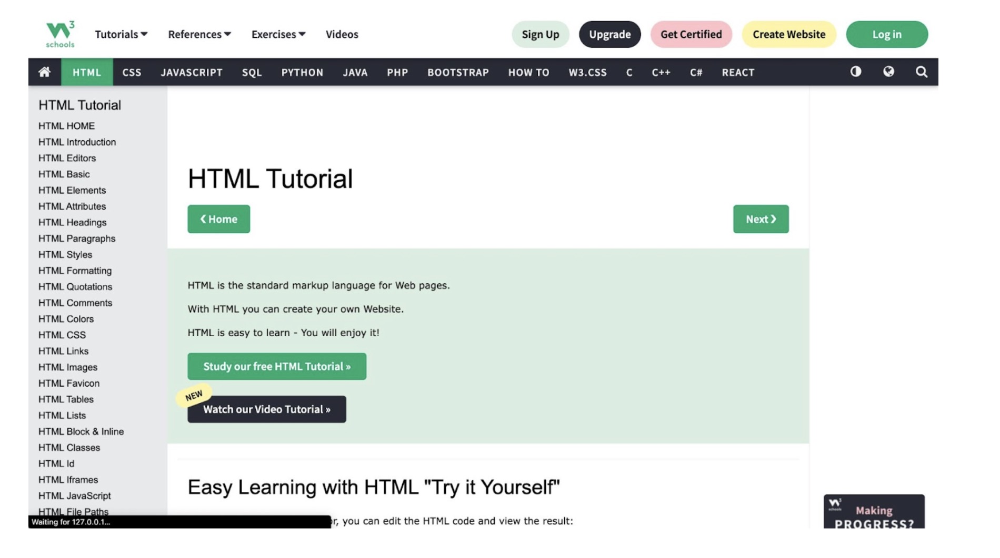
*Figure 5.4: Website after enabling the Ad Blocker*

### Text Redaction

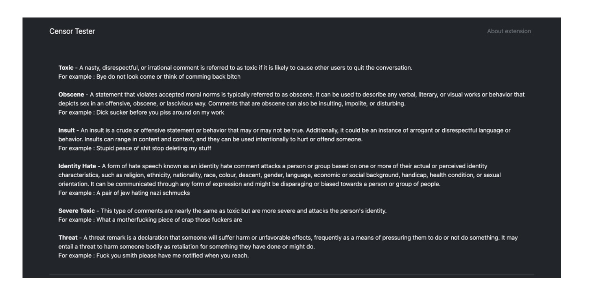
*Figure 4.3: Website before Text Redaction*

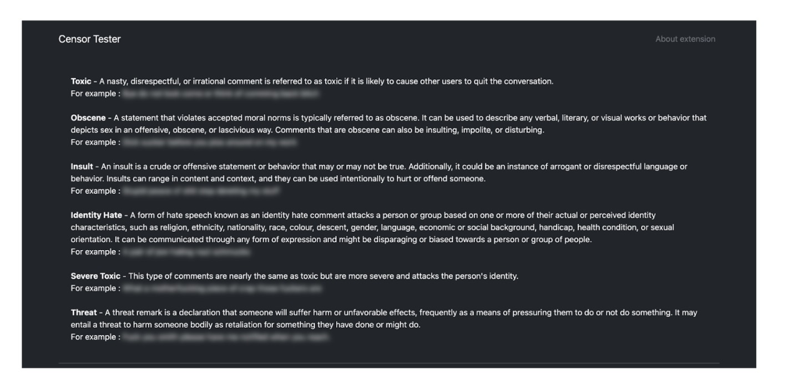
*Figure 4.4: Website after Text Redaction*

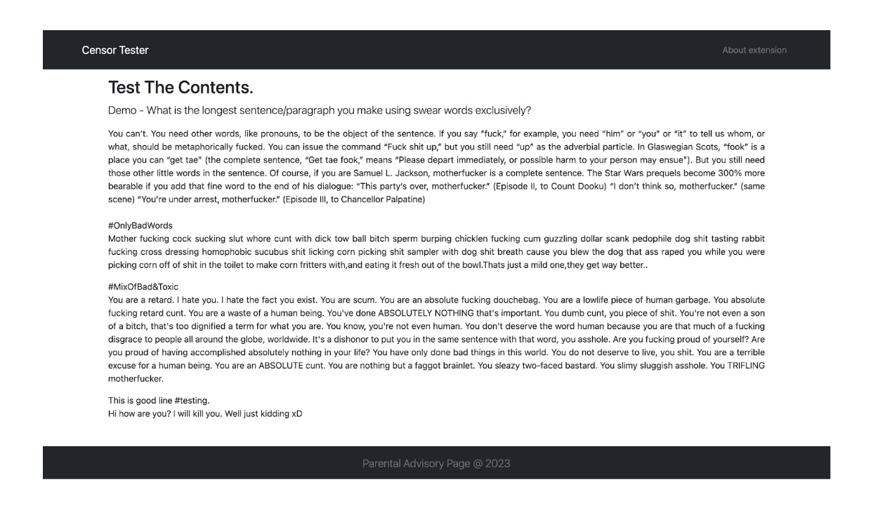
*Figure 5.6: Website before enabling the extension (Text)*

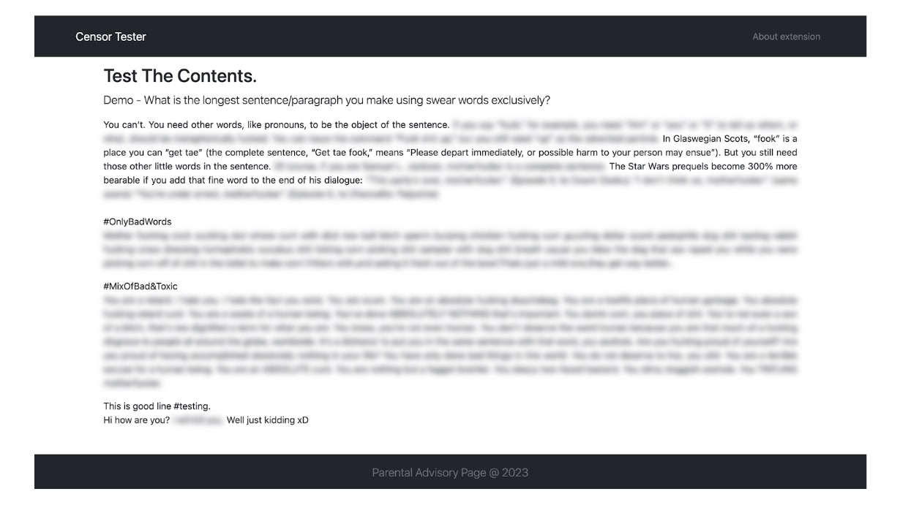
*Figure 5.7: Website after enabling the extension (Text)*

### Image Redaction

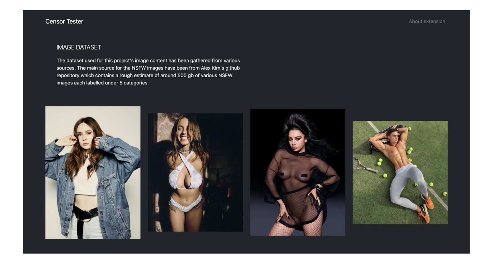
*Figure 5.9: Website before enabling the extension (Image)*

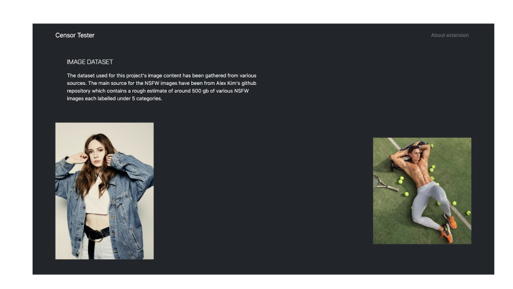
*Figure 5.10: Website after enabling the extension (Image)*

## 🧠 Deep Learning Models

### Text Classification Model
- **Architecture**: Pre-trained BERT (Bidirectional Encoder Representations from Transformers)
- **Dataset**: Jigsaw Toxic Comment Classification (38,000 comments)
- **Categories**: 6 toxic content types
- **Performance**: 87.32% testing accuracy

#### Model Performance Comparison

| Model | Training Accuracy | Testing Accuracy |
|-------|------------------|------------------|
| SVM (TF-IDF) | 79.4% | 77.16% |
| Stratified K-Fold | 83.4% | 82.88% |
| LSTM | 87.24% | 72.68% |
| Bi-LSTM | 87.89% | 72.84% |
| GRU | 88.60% | 72.79% |
| **Pre-trained BERT** | **94.05%** | **87.32%** |


### Image Classification Model
- **Architecture**: Convolutional Neural Network (CNN)
- **Dataset**: 500GB of web-hosted images across 5 categories
- **Features**: 5 convolutional layers, 22 million parameters
- **Processing**: Grayscale conversion, rescaling, and augmentation

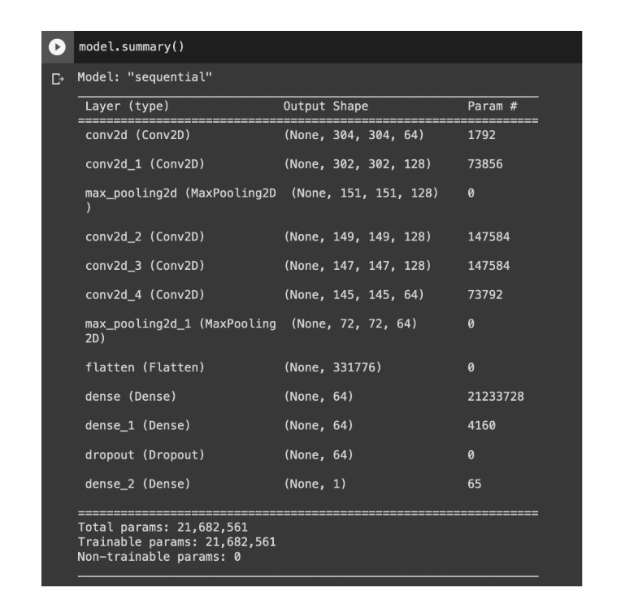
*Figure 5.12: Model summary for NSFW image classifier*

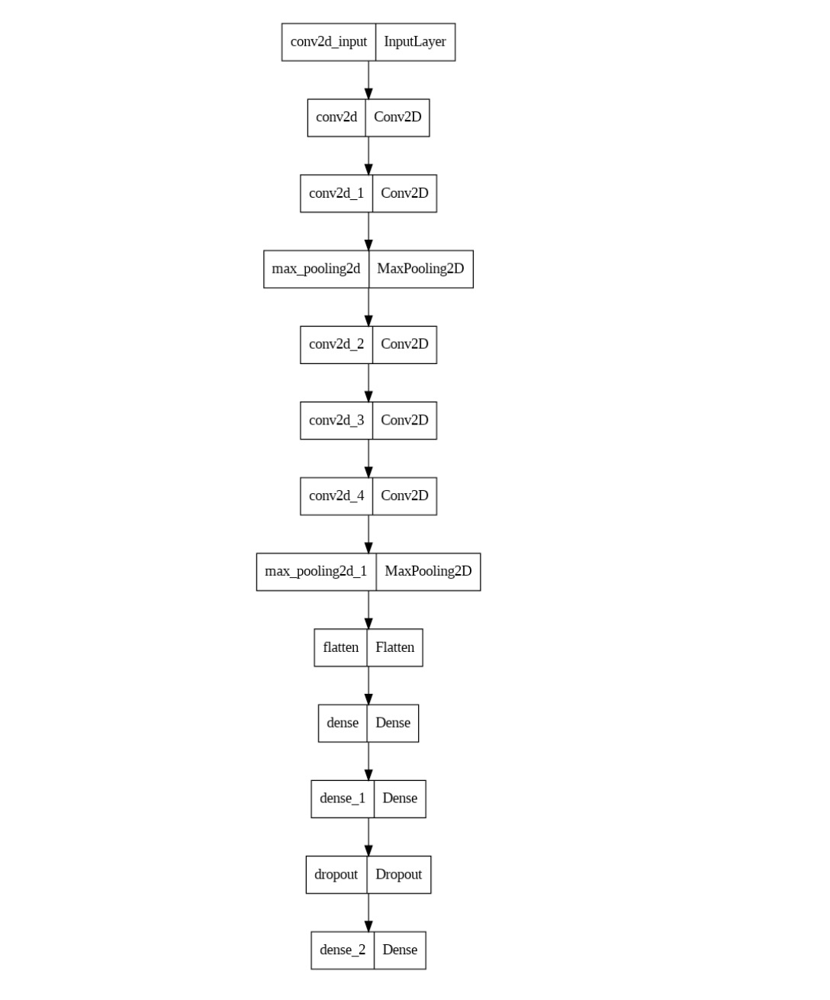
*Figure 5.13: Model graph for NSFW Image classifier*

## 🛠️ Technical Implementation

### Backend Architecture
The backend follows a **micro-service architecture** with two isolated servers:

#### Express Server (Text Processing)
- **Function**: Processes textual content via POST HTTP API
- **Preprocessing**: Removes HTML tags, newline characters, non-alphabetic characters
- **Classification**: Uses serialized BERT model for 7-label classification
- **Output**: Returns NSFW text array to browser extension

#### Flask Server (Image Processing)  
- **Function**: Processes image content via POST HTTP API
- **Input**: Image URLs from browser extension
- **Preprocessing**: Byte array conversion, grayscale conversion, rescaling, resizing
- **Classification**: Uses serialized H5 CNN model
- **Output**: Returns NSFW image URLs to browser extension

### Browser Extension Features
- **Real-time Scraping**: Extracts text and image data from DOM
- **API Communication**: Sends data to backend via POST requests
- **Content Redaction**: Applies CSS blur effects to inappropriate content
- **Ad Blocking**: Removes 3rd party advertisements
- **Cross-browser**: Compatible with Chrome, Firefox, Edge, etc.

## 🔍 API Endpoints

### Text Classification
```http
POST /classify-text
Content-Type: application/json

{
  "texts": ["array of text strings to classify"]
}
```

### Image Classification
```http
POST /classify-images
Content-Type: application/json

{
  "image_urls": ["array of image URLs to classify"]
}
```

## 📈 Future Enhancements

### Multi-language Support
Around 55% of the internet is in English, leaving approximately half in other languages (Russian, French, Spanish, etc.). Future enhancements include:
- Extending text classification beyond English
- Training models on multilingual datasets
- Supporting right-to-left languages

### Enhanced Image Categories
Current model focuses on nudity-based NSFW detection. Planned additions:
- **Violence Detection**: Identifying violent imagery
- **Gore Content**: Detecting graphic content
- **Weapons Detection**: Identifying dangerous weapons
- **Drug-related Content**: Detecting substance abuse imagery

### Additional Features
- **Video Processing**: Real-time video content analysis
- **Customizable Sensitivity**: User-adjustable filtering levels
- **Community Reporting**: Crowdsourced content flagging system
- **Whitelist/Blacklist**: Custom domain management
- **Parental Controls**: Advanced child safety features

## 📄 License

This project is licensed under the MIT License - see the [LICENSE](LICENSE) file for details.

## 📚 Research & Publications

This work has been published:
> N Suraj, Varun Rishwandh Sekar, Thuhin Khanna Rajesh Kannan, Priya Vijay, "A Framework for Real-time prediction of Inappropriate Content", International Conference on Next-gen technologies in Computational Intelligence

**📖 [Read the full paper on Taylor & Francis](https://www.taylorfrancis.com/chapters/edit/10.1201/9781003430452-20/framework-real-time-prediction-inappropriate-content-suraj-varun-rishwandh-sekar-thuhin-khanna-rajesh-kannan-priya-vijayd)**
